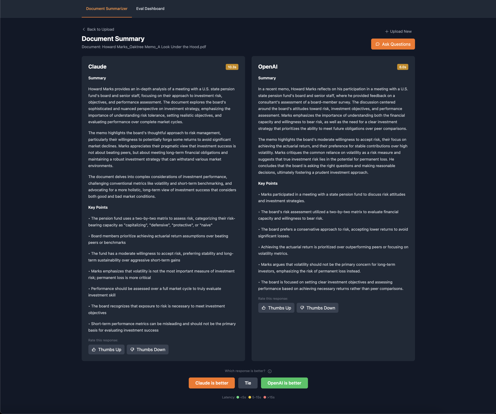
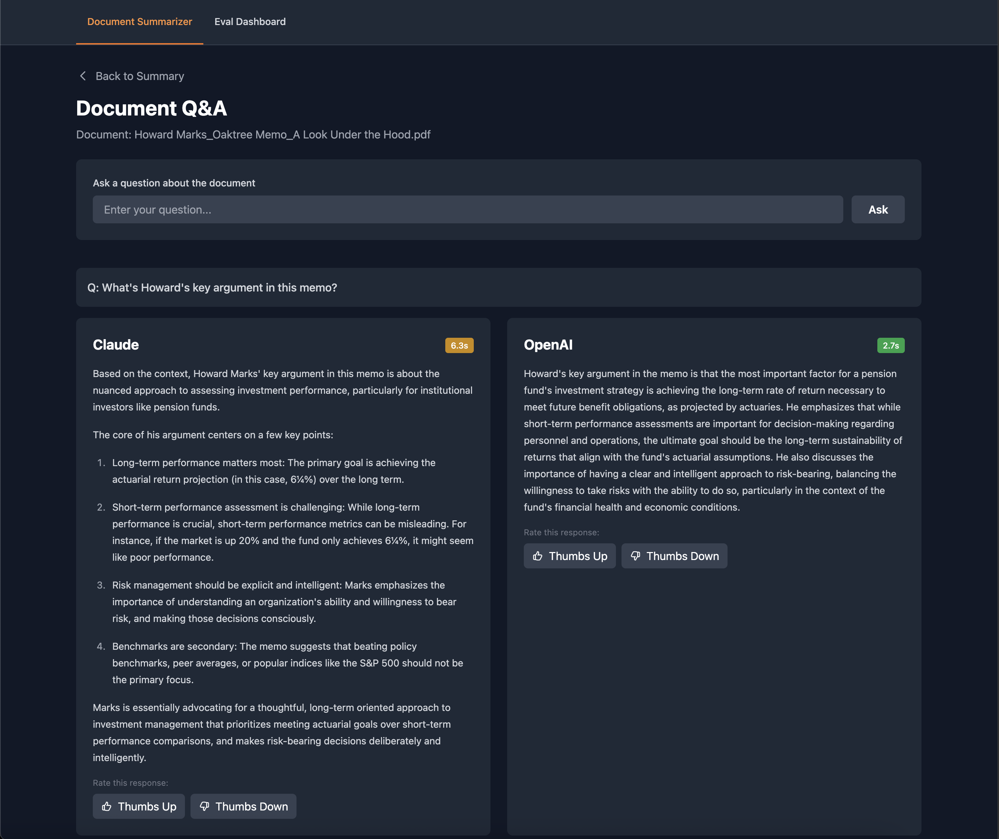
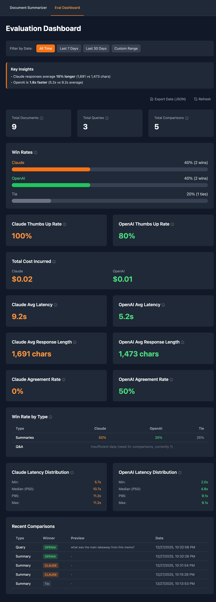
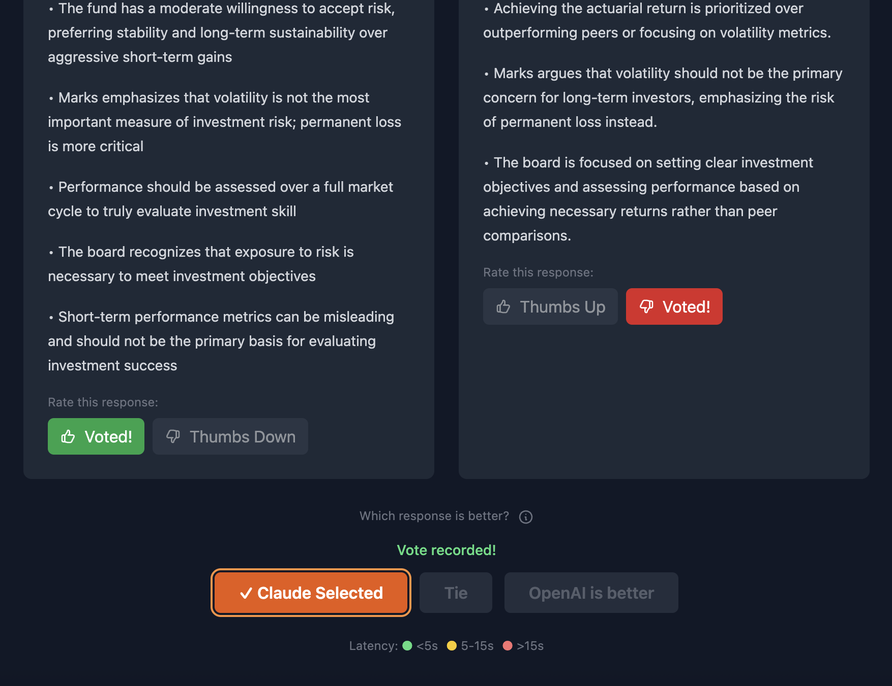
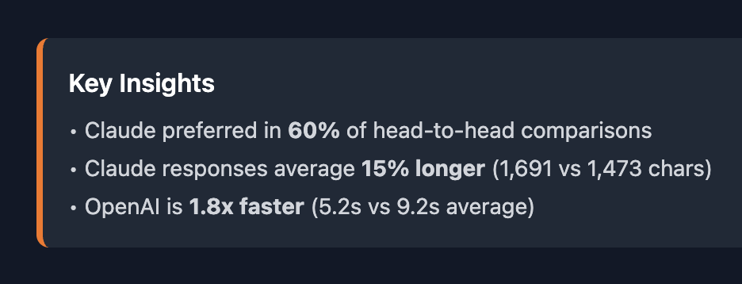
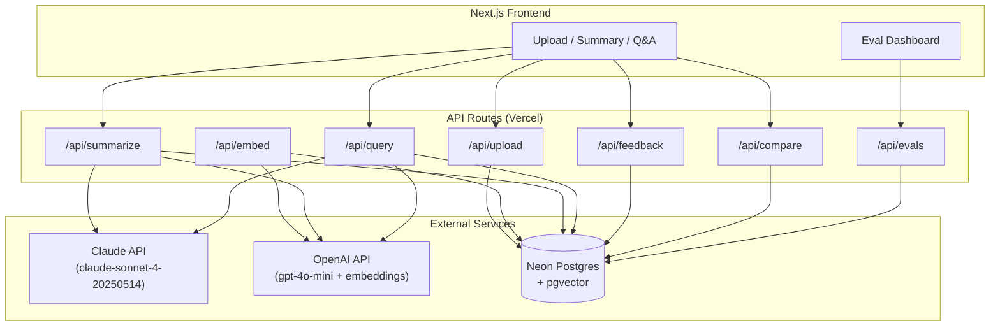

# Document Summarizer

Compare Claude and OpenAI responses side-by-side with a built-in evaluation framework. Upload PDFs, generate summaries from both models, ask questions using RAG, and vote on which responses are better. Track win rates, latency, cost, and quality metrics in a real-time dashboard.

**Live Demo:** [document-summarizer-dun.vercel.app](https://document-summarizer-dun.vercel.app)

[](https://nextjs.org)
[](https://typescriptlang.org)
[](https://anthropic.com)
[](https://openai.com)

## Highlights

- **Side-by-Side Comparison** — Every summary and Q&A response generated by both Claude and OpenAI in parallel
- **Evaluation Framework** — Vote on responses, track win rates, thumbs up/down ratings, and agreement metrics
- **RAG-Powered Q&A** — Ask questions answered using retrieved document chunks with cosine similarity
- **Cost & Latency Tracking** — Monitor token usage, response times (P50/P95), and API costs per model
- **Export Analytics** — Download evaluation data as JSON for offline analysis
- **Date Range Filtering** — Analyze metrics over custom time periods

<p align="center">
  
  <br/>
  <sub><b>Summary View</b> — Claude vs OpenAI with latency badges and voting controls</sub>
</p>

<table>
  <tr>
    <td align="center" width="50%">
      
      <br/>
      <sub><b>Q&A</b> — RAG-based answers from both models</sub>
    </td>
    <td align="center" width="50%">
      
      <br/>
      <sub><b>Eval Dashboard</b> — Win rates, latency, cost tracking</sub>
    </td>
  </tr>
  <tr>
    <td align="center" width="50%">
      
      <br/>
      <sub><b>Voting</b> — Thumbs up/down + head-to-head comparison</sub>
    </td>
    <td align="center" width="50%">
      
      <br/>
      <sub><b>Insights</b> — Auto-generated performance analysis</sub>
    </td>
  </tr>
</table>

## Why This Exists

Building AI applications isn't just about calling APIs — it's about understanding which model works best for your use case. This tool demonstrates:

- **Model Evaluation** → Systematic comparison of Claude vs OpenAI on real documents
- **Quality Metrics** → Beyond "does it work" to "which is better and why"
- **Cost Awareness** → Track actual API costs to inform model selection
- **Production Patterns** → RAG implementation, caching, observability

## Architecture



## Tech Stack

| Layer | Technology |
|-------|------------|
| Framework | Next.js 14 (App Router) |
| Language | TypeScript |
| Styling | Tailwind CSS |
| Database | Neon Postgres + Drizzle ORM |
| Embeddings | OpenAI text-embedding-3-small |
| LLMs | Claude Sonnet, GPT-4o-mini |
| PDF Parsing | pdf-parse |
| Deployment | Vercel |

## Quickstart

```bash
# Clone
git clone https://github.com/nickcarndt/document-summarizer.git
cd document-summarizer

# Install
npm install

# Configure
cp .env.example .env.local
# Add your API keys to .env.local

# Database
npx drizzle-kit push

# Run
npm run dev
```

Open [http://localhost:3000](http://localhost:3000)

### Environment Variables

```bash
ANTHROPIC_API_KEY=sk-ant-...
OPENAI_API_KEY=sk-...
DATABASE_URL=postgresql://...
```

## Features

### Side-by-Side Comparison

Every document generates summaries from both Claude and OpenAI in parallel:
- Latency badges (green <5s, yellow 5-15s, red >15s)
- Character count comparison
- Independent thumbs up/down per response
- Head-to-head "which is better" voting

### RAG-Powered Q&A

Documents are chunked (1500 chars, 200 overlap) and embedded:
1. Question is embedded using text-embedding-3-small
2. Top 5 chunks retrieved via cosine similarity
3. Both models generate answers using same context
4. Side-by-side display with voting

### Evaluation Dashboard

Real-time metrics:
- **Win Rates** — Percentage of comparisons won
- **Thumbs Up Rate** — Absolute quality rating
- **Agreement Rate** — How often winner also got thumbs up
- **Latency Distribution** — Min, P50, P95, Max
- **Response Length** — Average character count
- **Cost Tracking** — Actual API costs based on tokens
- **Win Rate by Type** — Summaries vs Q&A breakdown

### Key Insights

Auto-generated summary highlighting:
- Overall model preference
- Response length differences
- Speed comparison
- Quality consensus

## Demo Walkthrough

1. **Upload** a PDF (financial report, technical doc, etc.)
2. **Compare** summaries from both models
3. **Vote** on which summary is better
4. **Ask questions** about the document
5. **Rate** Q&A responses
6. **View dashboard** for aggregate metrics
7. **Export** data as JSON for analysis

## API Routes

| Route | Method | Description |
|-------|--------|-------------|
| `/api/upload` | POST | Upload PDF, extract text |
| `/api/embed` | POST | Chunk and embed document |
| `/api/summarize` | POST | Generate summaries (both models) |
| `/api/summaries/[docId]` | GET | Get existing summaries |
| `/api/query` | POST | RAG Q&A (both models) |
| `/api/feedback` | POST | Record thumbs up/down |
| `/api/compare` | POST | Record comparison vote |
| `/api/evals` | GET | Dashboard metrics |
| `/api/evals/export` | GET | Export all data as JSON |

## Development

```bash
npm run dev        # Development server
npm run build      # Production build
npm run typecheck  # TypeScript check
npm run lint       # ESLint
```

## Deploy to Vercel

1. Push to GitHub
2. Import in Vercel
3. Add environment variables
4. Deploy

## Sample Results

After testing on financial documents:

| Metric | Claude | OpenAI |
|--------|--------|--------|
| Win Rate | 78% | 22% |
| Avg Latency | 16.2s | 8.3s |
| Avg Length | 2,601 chars | 2,118 chars |
| Thumbs Up | 67% | 60% |
| Cost | $0.30 | $0.02 |

**Insight:** Claude preferred for synthesis quality despite higher latency and cost. OpenAI competitive on speed.

## Future Improvements

- [ ] Multi-document batch analysis
- [ ] Statistical significance on win rates
- [ ] Additional model support (Gemini, Llama)
- [ ] Blind A/B testing mode
- [ ] User accounts for preference tracking

## License

MIT — see [LICENSE](LICENSE)

## Author

Built by [Nick Arndt](https://github.com/nickcarndt) — demonstrating applied AI engineering and LLM evaluation patterns.
