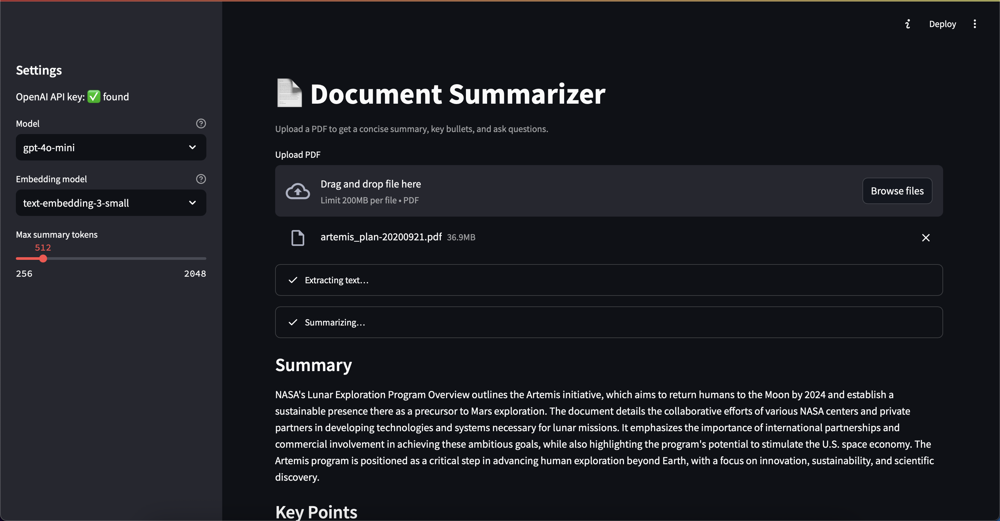
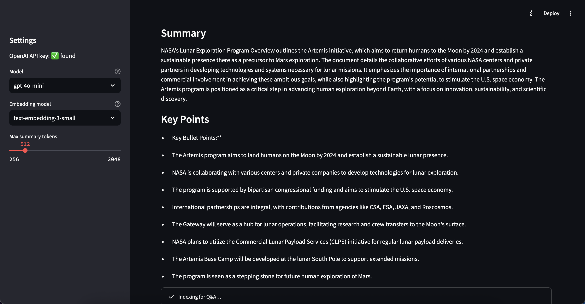
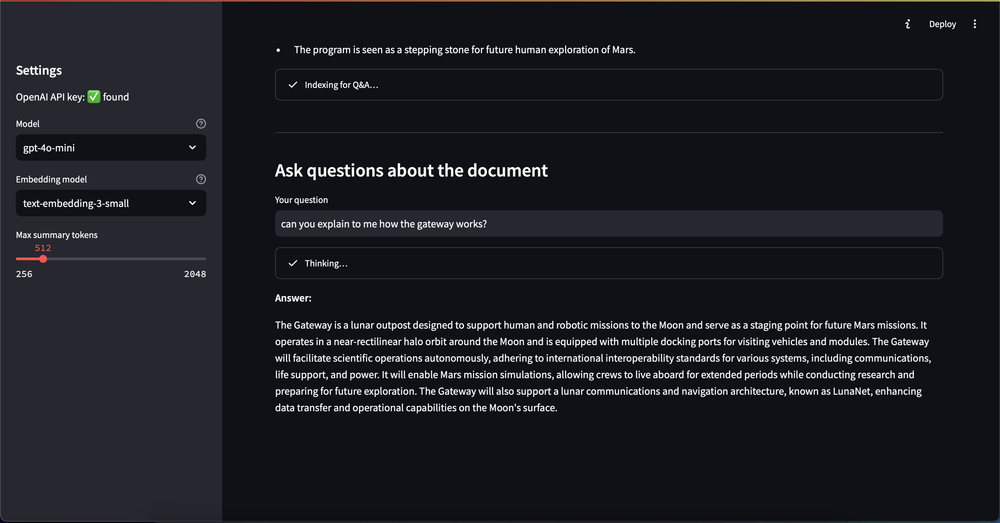

# Document Summarizer

A lightweight AI app for summarizing and querying PDFs using OpenAI models.

[](https://python.org)
[](https://streamlit.io)
[](https://openai.com)

## Features

- 📄 **PDF Upload**: Support for documents up to 200MB
- 🤖 **AI Summarization**: Generate concise summaries using GPT-4o-mini
- 📝 **Key Points**: Extract bullet points automatically
- ❓ **Document Q&A**: Ask natural-language questions using embeddings-based retrieval
- ⚙️ **Customizable**: Adjustable token limits and model selection
- 🎨 **Modern UI**: Clean, responsive Streamlit interface

## 📸 Screenshots  

  
  


## Quick Start

### Prerequisites

- Python 3.9 or higher
- OpenAI API key

### Installation

1. **Clone the repository**
   ```bash
   git clone https://github.com/nickcarndt/Document-Summarizer.git
   cd Document-Summarizer
   ```

2. **Create virtual environment**
   ```bash
   python3 -m venv .venv  # On macOS/Linux use python3
   source .venv/bin/activate  # On Windows: .venv\Scripts\activate
   ```

3. **Install dependencies**
   ```bash
   pip install -r requirements.txt
   ```

4. **Set up environment variables**
   
   Create a `.env` file in the project root:
   ```bash
   echo "OPENAI_API_KEY=sk-your-actual-key-here" > .env
   ```
   
   Or export directly:
   ```bash
   export OPENAI_API_KEY=sk-your-actual-key-here
   ```

5. **Activate virtual environment and run the application**
   ```bash
   source .venv/bin/activate  # On Windows: .venv\Scripts\activate
   streamlit run app.py
   ```

6. **Open your browser**
   
   Navigate to `http://localhost:8501`

## Usage

1. **Upload a PDF**: Use the file uploader to select your document
2. **View Summary**: The app automatically extracts text and generates a summary
3. **Review Key Points**: Browse the automatically generated bullet points
4. **Ask Questions**: Use the Q&A section to query specific information about the document

### Example Output

**Summary:**
The document outlines a comprehensive strategy for implementing AI-powered document analysis in enterprise environments, focusing on scalability, security, and user experience. It emphasizes the importance of choosing the right LLM model for specific use cases and implementing proper data governance frameworks.

**Key Points:**
- AI document analysis can reduce processing time by 80% compared to manual review
- GPT-4o-mini provides optimal cost-performance balance for most use cases
- Embedding-based retrieval enables accurate Q&A without full document context
- Security considerations include data encryption and access controls
- Integration with existing workflows requires careful API design
- Performance monitoring and error handling are critical for production deployment

## Technical Details

- **Backend**: Python 3.9+ with Streamlit
- **AI Models**: OpenAI GPT-4o-mini for summarization, text-embedding-3-small for retrieval
- **PDF Processing**: PyPDF for text extraction
- **Vector Search**: Cosine similarity for document chunk retrieval
- **Environment**: Virtual environment with pinned dependencies

## Future Improvements

- 📚 **Multi-document support**: Process multiple PDFs simultaneously
- 🔍 **Enhanced RAG**: Implement more sophisticated retrieval strategies
- ☁️ **Cloud deployment**: Deploy to Streamlit Community Cloud or AWS
- 📊 **Analytics**: Track usage patterns and document insights
- 🔐 **Authentication**: Add user management and document access controls
- 🌐 **API**: RESTful API for integration with other applications

## License

MIT License - see [LICENSE](LICENSE) file for details.

## Contributing

Contributions are welcome! Please feel free to submit a Pull Request.
